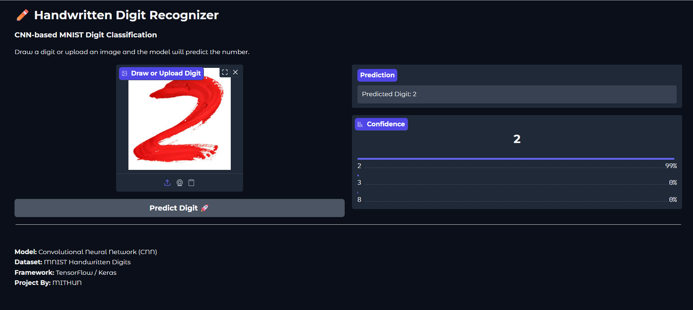

# ✏️ Handwritten Digit Recognizer (CNN + Gradio)

A **deep learning web application** that recognizes handwritten digits using a **Convolutional Neural Network (CNN)** trained on the **MNIST dataset**.

Users can **upload a digit**, and the model predicts the number in real time.

The application is built using **TensorFlow/Keras and Gradio** and deployed on **Hugging Face Spaces**.

---

# 🚀 Live Demo

Try the application here:

https://huggingface.co/spaces/mithun-74/digit-recognizer

---

# 🧠 Project Overview

Handwritten digit recognition is a classic computer vision task.  
This project uses a **CNN model trained on the MNIST dataset** to classify digits from **0–9**.

The application provides an interactive interface where users can:

- upload an image
- instantly get model predictions

---

# 🖼️ Screenshots

### Application Interface

---

# 🛠️ Tech Stack

- Python
- TensorFlow / Keras
- Convolutional Neural Networks (CNN)
- OpenCV
- Gradio
- Hugging Face Spaces

---

# 👨‍💻 Author

MITHUN S K

GitHub  
https://github.com/Mithun-74

---

# ⭐ Support

If you found this project helpful, please consider **starring the repository** ⭐

